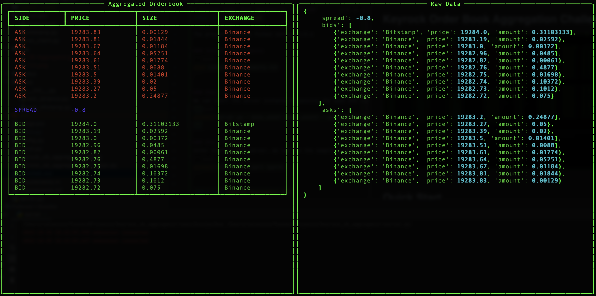

# Keyrock Order Book Aggregation Challenge

# Quick Start
The project supports Python version >=3.6 

### Install requirements
```bash
pip3 install requirements.txt
```

### Start Server
We can start the server instance by passing the base and quote asset of the pair we would like to stream data for:
```bash
python3 server.py --base_asset {base_asset} --quote_asset {quote_asset} --levels {levels} --port {port}
```

Where the parameters are as follows:
* `base_asset` - The base asset of the pair (e.g. `BTC`)
* `quote_asset` - The quote asset of the pair (e.g. `USDT`)
* `levels` - The number of levels to display per side - default is `10`
* `port` - The port of the RPC server - default is `50052`

### Start Client
After starting the server, we can run the sample client, which will listed to the data stream and output the order book:
```bash
python3 client.py --port {port}
```


# Implementation

## Market Data Ingestion
An implementation of a simple threaded exchange websocket class is created (`WSClient`). 
Each exchange class is a child class from `WSClient` and runs on a separate thread. 
Both exchanges and the RPC server share a data object and a lock.

The data objects consists of an efficient order book class (written in C) for each exchange and a variable
for the last update time.
```
{
    "Binance": OrderBook(),
    "Bitstamp": OrderBook(),
    "last_updated_time": some_time
}
```
The lock is shared between exchange instances and the RPC server in order to avoid showing 
partial updates.

## Aggregation
The RPC servicer compares the last update time of the shared data object and the last transmission.
If the last update time is > last transmission time, then and order book aggregation is triggered.


# Exchange connectivity

## Binance

Binance supports two types of order book websocket data:

- Order book snapshots
- Order book incremental updates

The current implementation supports incremental updates with an initial snapshot retrieval from the REST API. 
Incremental updates introduced less latency due to the small payloads compared to full snapshots.

#### Update Frequency: 100ms
#### Retrieved Order Book Depth: Complete Depth*

*Note: We fetch the complete book depth, rather than the partial book depth in order to accommodate for dust order filtering. 


## Bitstamp
Bitstamp supports only order book snapshots.

#### Update Frequency: Unknown
#### Retrieved Order Book Depth: 100 (default)

# Testing


# To-do

* Check if the provided pair exists on both exchanges
* Further testing and exception handling for exchange-specific connectivity errors
* Use FIX for Bitstamp
* Move the service to a more efficient language such as Rust (Hopefully I get to do it soon)