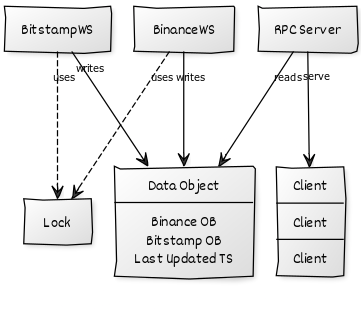

# Keyrock Order Book Aggregation Challenge

# Quick Start
The project supports Python version >=3.6 

### Install requirements
```bash
pip3 install -r requirements.txt
```

### Start Server
We can start the server instance by passing the base and quote asset of the pair we would like to stream data for:
```bash
python3 server.py --base_asset {base_asset} --quote_asset {quote_asset} --levels {levels} --port {port}
```

Where the parameters are as follows:
* `base_asset` - The base asset of the pair (e.g. `BTC`)
* `quote_asset` - The quote asset of the pair (e.g. `USDT`)
* `levels` - The number of levels to display per side - default is `10`
* `dust_amount` - Will ignore orders below the provided amount - default is `0`
* `port` - The port of the RPC server - default is `50052`

### Start Client
After starting the server, we can run the sample client, which will listed to the data stream and output the order book:
```bash
python3 client.py --port {port}
```


# Implementation

## Market Data Ingestion
An implementation of a simple threaded exchange websocket class is created (`WSClient`). 
Each exchange class is a child class from `WSClient` and runs on a separate thread. 
Both exchanges share a data object and a lock. The data object is shared with the RPC server.


The data objects consists of an efficient order book class (written in C) for each exchange and a variable
for the last update time.
```
{
    "Binance": OrderBook(),
    "Bitstamp": OrderBook(),
    "last_updated_time": some_time
}
```


## Aggregation
The RPC servicer compares the last update time of the shared data object and the last transmission.
If the last update time is > last transmission time, then and order book aggregation is triggered.

For `bids` and `asks` per exchange, we retrieve the top `levels` number of order level that is 
greater than `dust_amount`. Next, we create a `bids` list and an `asks` list by concatenating 
the orders from both exchanges. Finally, we sort them and retrieve the top `levels` for both
`bids` and `asks`. We use the build-in Python `sorted()` function due to its speed.


```python
    def parse_ob(self, exchange: str, side: str) -> List[keyrock_ob_aggregator_pb2.Level]:
        """
        Convert the order book side into a list of gRPC objects.
        Limit the number to the defined number of levels.
        Filter orders of sizes less than dust amount.
        """
        ob = []
        for i in range(len(self.orderbook[exchange][side])):
            if len(ob) >= self._levels:
                break
            p, a = self.orderbook[exchange][side].index(i)
            if a > self._dust_amount:
                ob.append(keyrock_ob_aggregator_pb2.Level(exchange=exchange, price=p, amount=a))
        return ob

    def get_agg_ob(self) -> keyrock_ob_aggregator_pb2.Summary:
        """
        Get the top bid&ask levels per exchange. Then merge
        and get the aggregated top bid&ask.
        """
        # Combine top bids and asks from each exchange
        bids = self.parse_ob(BINANCE, BIDS) + self.parse_ob(BITSTAMP, BIDS)
        asks = self.parse_ob(BINANCE, ASKS) + self.parse_ob(BITSTAMP, ASKS)

        # Then sort desc for bids and asc for asks
        sorted_bids = sorted(bids, key=lambda level: level.price, reverse=True)
        sorted_asks = sorted(asks, key=lambda level: level.price, reverse=False)

        # Calculate Spread
        spread = sorted_asks[0].price - sorted_bids[0].price

        # Return the summary object
        return keyrock_ob_aggregator_pb2.Summary(spread=spread, bids=sorted_bids[:self._levels], asks=sorted_asks[:self._levels])
```

# Exchange connectivity

## Binance

Binance supports two types of order book websocket data:

- Order book snapshots
- Order book incremental updates

The current implementation supports incremental updates with an initial snapshot retrieval from the REST API. 
Incremental updates introduced less latency due to the small payloads compared to full snapshots.

#### Update Frequency: 100ms
#### Retrieved Order Book Depth: Complete Depth*

*Note: We fetch the complete book depth, rather than the partial book depth in order to accommodate for dust order filtering. 


## Bitstamp
Bitstamp supports only order book snapshots.

#### Update Frequency: Unknown
#### Retrieved Order Book Depth: 100 (default)

# Testing
We use `pytest` for testing some exchange class methods.

To run tests, simply run `pytest` in the project directory:

For example:
```bash
(venv) (base) valentin@192 keyrock_ob_aggregator % pytest
========================================================================================================================== test session starts ==========================================================================================================================
platform darwin -- Python 3.9.13, pytest-7.2.0, pluggy-1.0.0
rootdir: /Users/valentin/PycharmProjects/keyrock_ob_aggregator
collected 5 items                                                                                                                                                                                                                                                       

tests/test_binance.py ...                                                                                                                                                                                                                                         [ 60%]
tests/test_bitstamp.py ..                                                                                                                                                                                                                                         [100%]

=========================================================================================================================== 5 passed in 0.24s ===========================================================================================================================
(venv) (base) valentin@192 keyrock_ob_aggregator % 
```

# To-do

* Check if the provided pair exists on both exchanges
* Further testing and exception handling for exchange-specific connectivity errors
* Use FIX for Bitstamp
* Move the service to a more efficient language such as Rust (Hopefully I get to do it soon)